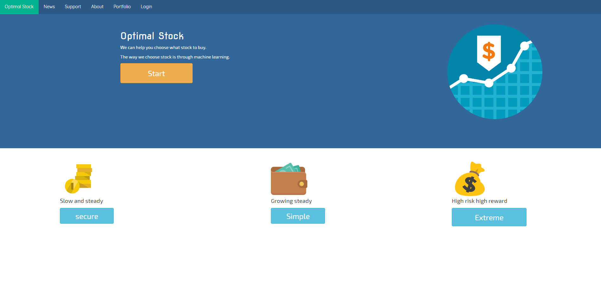
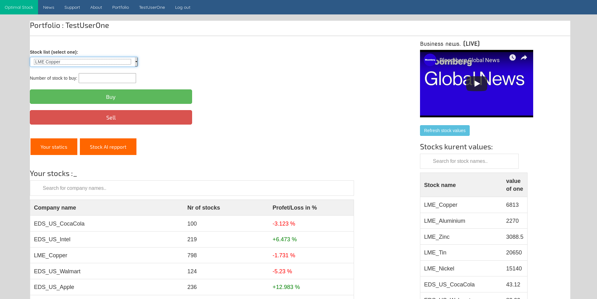

# Optimal-Stock
Website for finding  stocks and what to buy. This website was created for my webserver programing corse.
We can help you choose what stock to buy.

#### This was previously a private project but know public

Project was built in 2017-2018

#### Be aware that I have not uploaded the data base 

The way we choose stock is through machine learning.

This means that we does not let you buy or sell stock ate Optimal Stock. To day people don't trade on the stock market. To day computer makes the trades. But for the normal day Joe Blow that is not able to have the machines to trade for theme and to make predictions.
But what if you could get a leg up to everyday Joe Blow. Here is were Optimal Stock comes and is able to help you.

We offer tips on what stock to buy soe that you are able to maximise your profit on your stocks. There is always risk when you buy stocks but that is way. We offer three different risk levels soe that you can put your money ate the risk level that your comfortable with.

The stock predictions are made form machine learning AI. I have used quandl (www.quandl.com) for getting historical stock data.

## Index page

## User page

## What I learned

- [x] PHP and basic backend dev
- [x] Python 
- [x] basics in : panda, quandel, numpy, sklearn, matplotlib  
